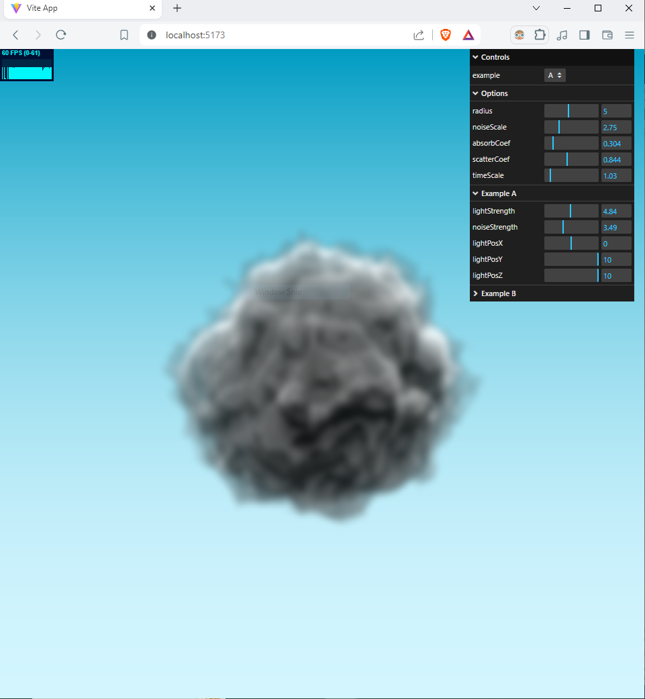
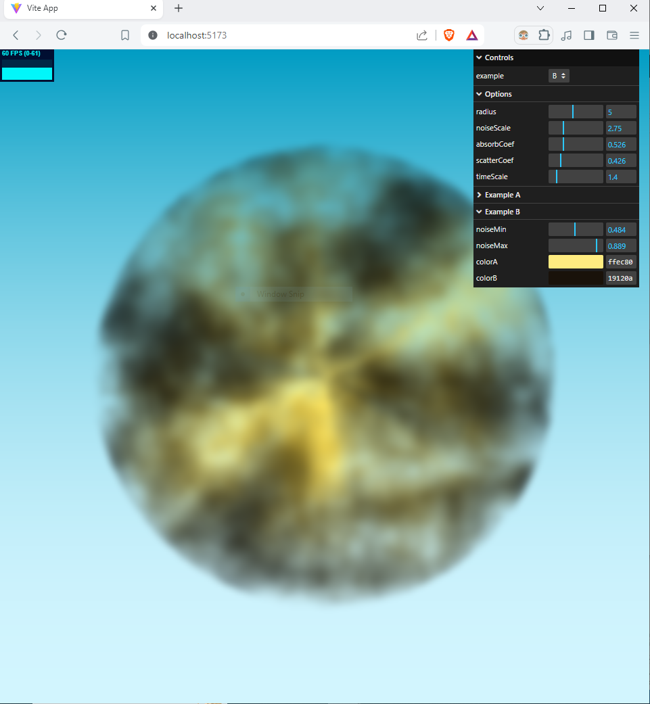

# Volume Rendering

My attempt to learn volumetric rendering. Built with [three.js](https://threejs.org/). Blue noise texture from [Moments in Graphics](https://momentsingraphics.de/BlueNoise.html). 

### Screenshot

### References

[How Big Budget AAA Games Render Clouds by SimonDev (youtube)](https://www.youtube.com/watch?v=Qj_tK_mdRcA)
[I Tried Recreating Counter Strike 2's Smoke Grenades by Acerola (youtube)](https://www.youtube.com/watch?v=ryB8hT5TMSg)
[Volume Rendering from scratchapixel](https://www.scratchapixel.com/lessons/3d-basic-rendering/volume-rendering-for-developers/intro-volume-rendering.html)
[Volumetric Rendering from cglearn](https://cglearn.eu/pub/advanced-computer-graphics/volumetric-rendering)
[Guerrilla Games cloud presentation](https://www.guerrilla-games.com/read/the-real-time-volumetric-cloudscapes-of-horizon-zero-dawn)